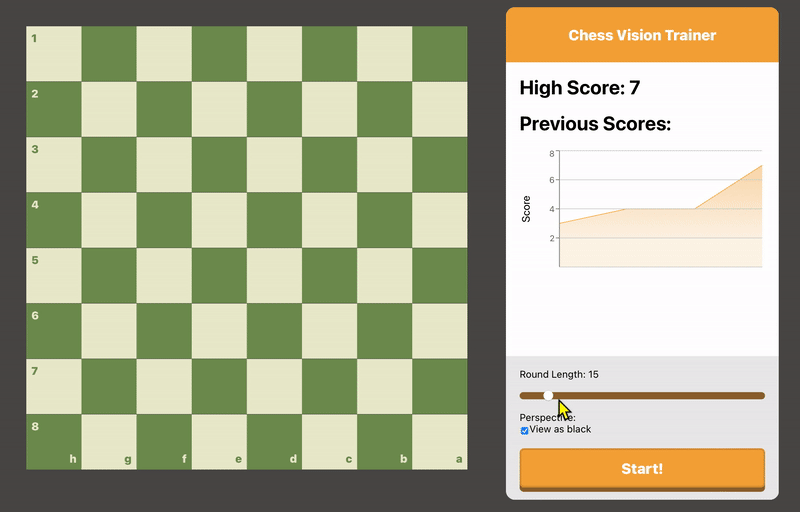

# Chess Square Names Trainer
Improve your ability to visualize squares on a chess board using this mini game. Read the prompt, and select that square to gain points. [Play now! – See you on the 64 Squares](https://gabrieltoja.github.io/chess-square-names-trainer)

Implemented by Gabriel Toja with React and Recharts. Inspired by the design of chess.com's vision game.
